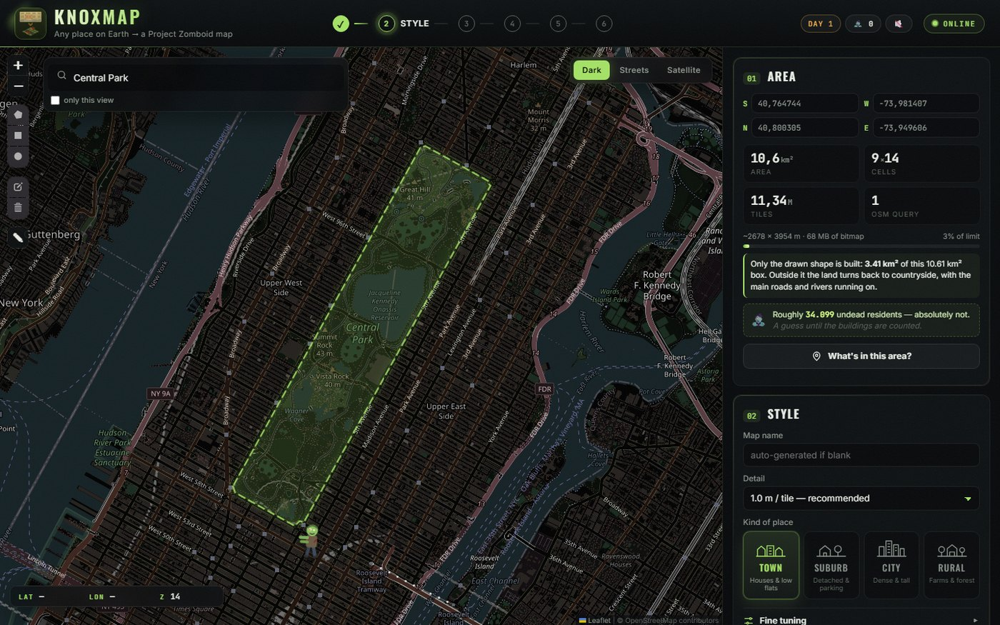
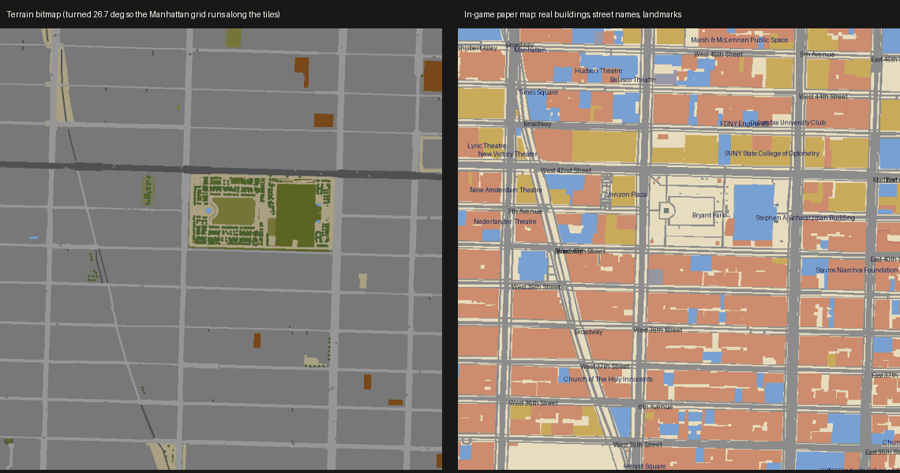
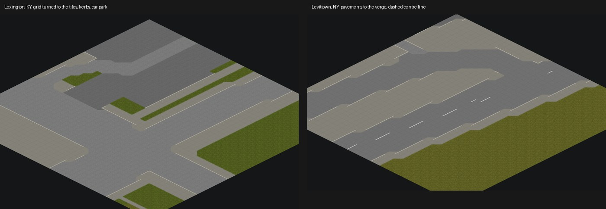
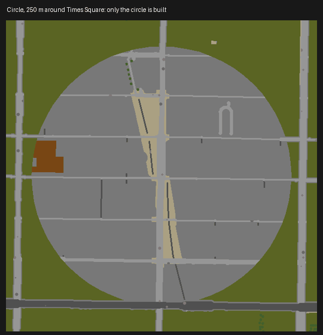

<p align="center">
  
</p>

<h1 align="center">KnoxMap</h1>

<p align="center"><strong>Draw any place on Earth. Play it in Project Zomboid.</strong></p>

<p align="center">
  
  
  
  
</p>

> [!IMPORTANT]
> KnoxMap is an **unofficial fan project**. It is not made, endorsed or supported
> by The Indie Stone. It contains no game files: it builds maps from your own copy
> of Project Zomboid. See [Disclaimers](#disclaimers).

KnoxMap turns a real place into a playable Project Zomboid map, from one window:

**choose an area → terrain → furnished buildings → compile → install into the game**

It reads the real streets, buildings, water, parks, railways and land use from
[OpenStreetMap](https://www.openstreetmap.org), fits every building onto its real
footprint with rooms, stairs, furniture and lights, spawns zombies where people
actually lived, and installs the result as a mod.

<p align="center">
  
  <br/><sub>Choosing an area: Central Park's real boundary, straight from a search. Map tiles © OpenStreetMap contributors.</sub>
</p>

## What you get

- **The real street plan.** Roads at their real widths, with pavements, kerbs
  and centre lines. The map is turned so the town's main street grid runs along
  the game's tiles, so streets are straight lines, not staircases.
- **Water, bridges and railways.** Seas and harbours, rivers with their bridges
  intact, canals, piers and railway lines.
- **Buildings you can walk into**, every one on its real footprint. Houses with
  bedrooms upstairs; blocks of flats with a corridor and separate flats; shops,
  schools, churches, clinics, offices and factories laid out as what they are.
  Every room has a light switch, every staircase is clear, and roofs follow the
  footprint.
- **Real heights, up to 30 storeys**, taken from OpenStreetMap where they are
  mapped and from the neighbours where they are not.
- **Working lifts** in buildings of five storeys or more, when the
  [Elevators](https://steamcommunity.com/sharedfiles/filedetails/?id=3780306632)
  mod is enabled (optional).
- **The real map in your pocket.** The in-game map (M) shows the real streets,
  buildings, water and woods, with real street names and landmarks labelled.
- **Zombies where the people were.** The spawn map comes from an estimate of who
  lived and worked in each building, and every part of it is adjustable.
- **Any shape you like**: a rectangle, a polygon, a circle, a freehand outline,
  or a place's real boundary.

<p align="center">
  
  <br/><sub>Midtown Manhattan around Bryant Park: the terrain (left), turned 26.7° to the street grid, and the paper map
  players carry in game (right). Map data © OpenStreetMap contributors.</sub>
</p>

<p align="center">
  
  <br/><sub>Streets as KnoxMap lays them, drawn with the game's own tiles by <code>tools/render_ground.py</code>
  (not an in-game screenshot). Tile artwork © The Indie Stone.</sub>
</p>

## Quick start

**You need:** Windows 10 or 11 · [Python 3.10 or newer](https://www.python.org/downloads/)
(tick *Add python.exe to PATH* when installing) · **Project Zomboid Build 42**
installed through Steam · an internet connection.

1. **Download KnoxMap**: the green **Code** button above → **Download ZIP**, then
   unzip it anywhere. (Or `git clone` it.)
2. **Double-click `KnoxMap.bat`.** The first time, it runs setup for you, which:
   - creates a private Python environment inside the KnoxMap folder,
   - downloads the free [PZ Mapping Tools](https://github.com/Unjammer/PZ_Mapping_Tools),
   - downloads the map compiler from this repository's releases and checks its fingerprint,
   - finds your Project Zomboid install and copies the tile artwork the map tools
     need **from your own copy of the game**,
   - adds the rules for kerbs, road markings and Build 42 trees to the map tools.

   It takes a few minutes, once. After that `KnoxMap.bat` opens straight away.
3. **Make a map** in the window that opens:
   1. **Choose an area** (see below). Start small, a few streets, while you get a
      feel for it.
   2. Pick a **kind of place** (Town, Suburb, City, Rural) and press **Generate map**.
   3. Under *Finish the map*: **Build** → **Compile** → **Install**.
4. **In Project Zomboid**: enable your map in **Mods** (and **Elevators** too, if
   you want working lifts), then start a **new** game and choose it. Existing
   saves never pick up new maps.

If anything is missing, a *Setup incomplete* panel in the app says exactly what
and how to fix it. You can run `Setup.bat` again at any time; it only does what
is still needed.

## Choosing an area

| Tool | How |
|---|---|
| **Search** | Type a place and press **Enter**. Pick a result for a box around it, or its **OUTLINE** button for the place's real boundary: a park, a district, a whole town. |
| **Rectangle** | Drag a box on the map. |
| **Polygon** | Click point by point round any outline; click the first point to finish. |
| **Circle** | Drag out a radius from a centre. |
| **Freehand ✎** | Drag round what you want. The line is smoothed into a clean outline. |

A shape is built only inside itself. The map still covers the shape's whole
bounding box (the game needs whole cells), but outside the shape the land turns
back to countryside, with the main roads and rivers running on so the town is not
an island.

You can also open KnoxMap straight to a place: add `?q=Bryant Park, New York` to
the address, and `&outline=1` to take its real boundary.

<p align="center">
  
</p>

## Tuning a map

Open **Fine tuning** under *Style*:

| Setting | What it does |
|---|---|
| **Zombies per person** | How many zombies each person who lived or worked there becomes. |
| **Living space** | Floor area per person. Lower means more crowded buildings and more zombies. |
| **Horde cap** | The most zombies one 10×10-tile spot can hold. Vanilla towns peak at 10. |
| **Flats above / Flats chance** | How readily large untagged buildings become blocks of flats. |
| **Tallest building** | The storey limit, up to 30. Real heights from OpenStreetMap are used where mapped. Tall cities take much longer to compile. |
| **Straighten streets** | 1 turns the map so its main street grid runs along the tiles; 0 keeps north straight up, with diagonal streets as staircases. |
| **Windows**, **Woodland**, **Parking**, **Room size** | What they say. |
| **Seed** | The same area and seed always give the same town. |

After **Build**, a **Zombie census** shows the estimated residents, workers and
zombies. Change the zombie settings and press **Recount** to redraw them in a
second without rebuilding, then compile again so the game sees the change.

<p align="center">
  
  <br/><sub>A generated block of flats, floor by floor: a corridor, flats outlined in orange, stairs, doors and windows.</sub>
</p>

## Good to know

- **Size and time.** A few square kilometres is a comfortable town. Compiling is
  the slow part: a 600 × 600 m city block takes a minute or two, and several
  minutes with 30-storey towers.
- **North may not be up.** With *Straighten streets* on, the map is turned to
  its street grid, often by 20-45°. The in-game map is turned the same way.
- **Maps are cached.** Regenerating the same area reuses its OpenStreetMap
  download, so trying different settings is quick.
- **A map is only as good as OpenStreetMap's data for that place.** Well-mapped
  city centres come out best; rural areas often lack buildings entirely.
- **Where maps go.** Installed maps are copied into `%USERPROFILE%\Zomboid\mods`.
  Project files stay in KnoxMap's `output\` folder.

## Compatibility

- **Project Zomboid Build 42 only.** Build 41 cannot load these maps, and setup
  warns you if your game looks like Build 41.
- **Windows only.** The map compiler is a Windows program.
- **Mods:** the generated map is an ordinary map mod. Lifts need the optional
  [Elevators](https://steamcommunity.com/sharedfiles/filedetails/?id=3780306632)
  mod; without it they are just closed doors. Other map mods that occupy the same
  area of the world may conflict.
- **Multiplayer and dedicated servers:** not tested.

## Troubleshooting

| Problem | Fix |
|---|---|
| `Python 3.10 or newer is needed` | Install Python from python.org with *Add to PATH* ticked, then run `Setup.bat`. |
| Setup cannot find Project Zomboid | It asks for the folder: paste the `ProjectZomboid` folder from your Steam library. |
| Setup says the game looks like Build 41 | In Steam: right-click Project Zomboid → **Properties → Betas** → pick the Build 42 branch, then run `Setup.bat` again. |
| *OSM query failed* | The free OpenStreetMap servers are busy. Wait a minute and try again, or choose a smaller area. |
| The map is not in the game | Enable it under **Mods**, then start a **new** game. |
| The window is blank | Install the [Microsoft Edge WebView2 runtime](https://developer.microsoft.com/microsoft-edge/webview2/) (built into Windows 11). |
| KnoxMap closes straight away | It shows a message and writes `knoxmap_error.log` in the KnoxMap folder. Running `Setup.bat` again fixes most causes. |

Found a bug, or a place that comes out wrong? [Open an issue](../../issues/new/choose),
with screenshots if you can.

## For tinkerers

Everything the app does also works from the command line inside `.venv`:

```bat
.venv\Scripts\python -m knoxbuild output\mytown --preset city --set max_levels=12
.venv\Scripts\python tools\compile_map.py output\mytown
.venv\Scripts\python tools\render_ground.py output\mytown street.png 300 300 40 40
.venv\Scripts\python tools\audit_layouts.py 400
```

- [KNOXBUILD.md](KNOXBUILD.md): how buildings, rooms, lifts, fences, streets and
  the population model work, and the measurements behind them.
- [worlded/README.md](worlded/README.md): the map compiler patch and how to build
  it yourself.
- `tools/render_ground.py` draws a map's ground from the real tiles the way the
  compiler lays them; `tools/audit_layouts.py` stress-tests floor plans for
  sealed rooms, blocked stairs, bad roofs and lifts; `tools/validate_tbx.py`
  checks buildings against the editor's own rules.

## Disclaimers

**Not affiliated.** KnoxMap is an unofficial, non-commercial fan project. It is
not made, endorsed, supported or reviewed by The Indie Stone. *Project Zomboid*
and The Indie Stone are trademarks of The Indie Stone Ltd., used here only to
say what KnoxMap works with. Please do not contact The Indie Stone about
problems with KnoxMap or the maps it makes.

**No game files.** This repository and its releases contain no Project Zomboid
game files. Setup reads tile artwork from **your own installed, legitimately
owned copy** of the game and keeps it on your PC, for use with the map tools. Do
not redistribute those extracted files. Pictures in this README that are drawn
from the game's tiles (marked as such) contain artwork © The Indie Stone, shown
to illustrate what the tool produces.

> Thanks to The Indie Stone for creating Project Zomboid (https://projectzomboid.com/),
> which made this possible. This is an unofficial fan production for non-commercial
> purposes made under the [Indie Stone Terms](https://projectzomboid.com/blog/support/terms-conditions/).

**Real places, invented contents.** Maps are built from OpenStreetMap, which may
be incomplete, outdated or wrong, and KnoxMap simplifies it further. Everything
inside the buildings (rooms, furniture, loot, residents, zombies) is invented by
the generator and says nothing about the real building or anyone who lives or
works there. The population figures are rough estimates for gameplay, not real
statistics. **Do not use KnoxMap maps for navigation, planning, emergencies or
any real-world decision.** Please be thoughtful about where you set a zombie
game and what you share: homes, schools, hospitals and places of worship are
real places to the people who use them.

**Map data licence.** Map data © [OpenStreetMap contributors](https://www.openstreetmap.org/copyright),
available under the [Open Database License (ODbL)](https://opendatacommons.org/licenses/odbl/).
Every map KnoxMap installs carries the credit in game and an `ATTRIBUTION.txt`
saying which data it was made from and how.

**Publishing a map you made.** You may share maps made with KnoxMap for free.
If you do, on the Steam Workshop or anywhere else: keep `ATTRIBUTION.txt` in the
mod, credit **"Map data © OpenStreetMap contributors"** on its page, do not sell
it, and do not present it as official. Under The Indie Stone's
[Modding Policy](https://projectzomboid.com/blog/modding-policy/), publishing a
mod grants The Indie Stone a non-exclusive, royalty-free licence to use it in
connection with Project Zomboid.

**Online services.** KnoxMap uses OpenStreetMap's free, volunteer-run services
under their usage policies: the [tile server](https://operations.osmfoundation.org/policies/tiles/)
for the background map, [Nominatim](https://operations.osmfoundation.org/policies/nominatim/)
for place search, and the [Overpass API](https://dev.overpass-api.de/overpass-doc/en/preface/commons.html)
for map data. KnoxMap identifies itself, caches tiles, searches and downloads,
searches only when you press Enter, and paces its requests. Please do not modify
it to get around those limits; for heavy use, run your own servers.

**Privacy.** KnoxMap has no accounts, telemetry or analytics. The servers it
contacts, and what they see, are listed in [docs/LEGAL.md](docs/LEGAL.md#privacy).

**Third-party mods.** The Elevators mod is a separate work by its own author. It
is not included in, affiliated with or maintained by KnoxMap, and its behaviour
and compatibility are up to that mod. KnoxMap only lays out buildings the way the
mod recognises lifts.

**No warranty.** KnoxMap is provided as is, without warranty of any kind. Maps
are generated automatically and have not been checked in game place by place.
They can contain mistakes, and a map mod added to or removed from a save can
break that save. **Back up saves you care about.** The authors are not liable
for any damage or loss from using KnoxMap or its maps.

## Credits and licences

- **[Knoxify](https://github.com/arytek/knoxify)** by arytek: the original
  OpenStreetMap-to-Project-Zomboid terrain generator KnoxMap is built on.
- **[PZ Mapping Tools](https://github.com/Unjammer/PZ_Mapping_Tools)** by Alree /
  Unjammer, built on Tim Baker's TileZed and WorldEd (GPL).
- **Map data** © OpenStreetMap contributors (ODbL).
- **Elevators** mod for Project Zomboid, by its author, on the Steam Workshop.
- Thuztor's *Mapping Guide v0.2* for the terrain colour conventions.

The code here is under different terms depending on where it came from: work
added in this fork is MIT, the compiler patch in `worlded/` and its prebuilt
binary are GPL, and files from the original Knoxify have no published licence.
See **[LICENSES.md](LICENSES.md)** for the details, and
**[docs/LEGAL.md](docs/LEGAL.md)** for every licence and policy KnoxMap follows
and how.
