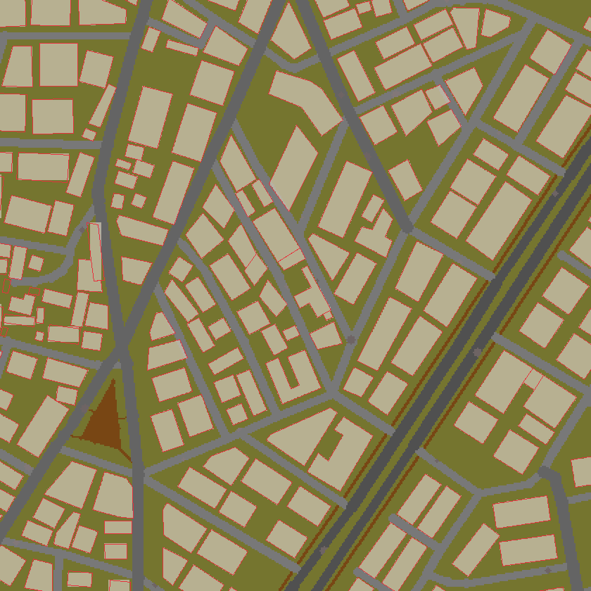
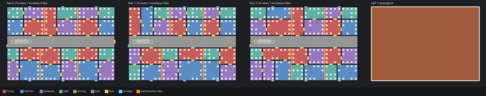
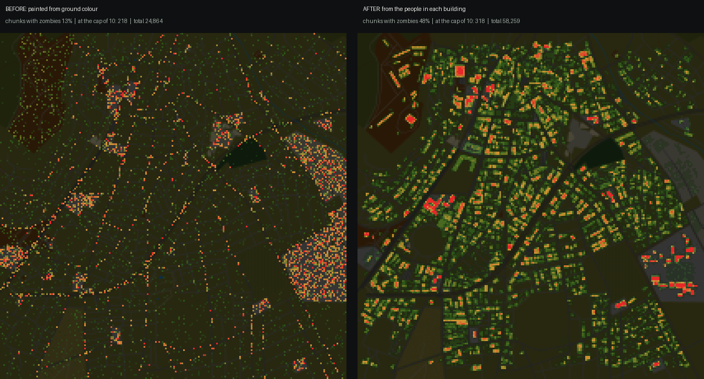

<p align="center">
  
</p>

<h1 align="center">KnoxMap</h1>

<p align="center"><em>Draw a rectangle anywhere on Earth. Play it in Project Zomboid.</em></p>

<p align="center">
  An unofficial fan tool for Project Zomboid Build 42 · Windows · built on
  <a href="https://github.com/arytek/knoxify">Knoxify</a> by arytek
</p>

---

KnoxMap turns a real place into a playable Project Zomboid map, from one
window:

**draw an area → terrain → furnished buildings → compile → install into the game**

It reads the real roads, buildings, parks, fences and land use from
OpenStreetMap, puts every building on its real footprint with rooms, stairs,
furniture and light switches, spawns zombies where people actually lived, and
installs the result as a mod.



*Central Bergama as generated. Beige is the game's buildings, the thin red
lines are the real footprints from OpenStreetMap. Map data © OpenStreetMap contributors.*

## What you get

- **The real street plan.** Roads follow their true shape and width, with
  kerbs, car parks and paved squares. Buildings sit on their real footprints,
  diagonal streets included.
- **Buildings you can walk into.** Houses with a living room by the front
  door, kitchen beside it and bedrooms upstairs. Blocks of flats with a
  corridor, separate flats and one front door each. Schools, shops, churches,
  clinics and factories laid out as what they are. Every room has a light
  switch, every staircase is clear, and roofs follow the footprint.
- **The ground between them.** Gardens, schoolyards, industrial yards,
  playgrounds, pools, cemeteries, orchards, fences, walls and hedges.
- **The real map in your pocket.** The in-game map (M) shows the real
  streets, buildings, rivers and woods, with real street names and
  landmarks labelled.
- **Zombies where the people were.** The spawn map is drawn from an estimate
  of who lived and worked in each building, and is fully adjustable.
- **Landmarks included.** Big buildings like factories and civic centres are
  kept, and buildings OpenStreetMap does not describe are typed from the land
  they stand on.

<p align="center">
  
  <br/><em>A generated block of flats: a corridor, flats outlined in orange, stairs, doors and windows.</em>
</p>

## Quick start

**You need:** Windows 10 or 11 · [Python 3.10 or newer](https://www.python.org/downloads/)
(tick *Add python.exe to PATH* when installing) · Project Zomboid Build 42
installed through Steam · an internet connection.

1. **Download KnoxMap**: the green **Code** button above → **Download ZIP**,
   then unzip it anywhere. (Or `git clone` it.)
2. **Double-click `KnoxMap.bat`.** The first time, it runs setup for you, which:
   - creates a private Python environment,
   - downloads the free [PZ Mapping Tools](https://github.com/Unjammer/PZ_Mapping_Tools),
   - downloads the map compiler from this repository's releases and checks it,
   - finds your Project Zomboid install and copies the tile artwork the map
     tools need out of your own copy of the game.

   It takes a few minutes once. After that, `KnoxMap.bat` opens straight away.
3. **Make a map** in the window that opens:
   1. Search for a place, or use the rectangle tool on the map's left edge to
      draw an area. Start small - a few streets - while you get a feel for it.
   2. Pick a **kind of place** (Town, Suburb, City, Rural) and press
      **Generate map**.
   3. Under *Finish the map*: **Build** → **Compile** → **Install**.
4. **In Project Zomboid**: enable your map in **Mods**, then start a **new**
   game and choose it. Existing saves never pick up new maps.

If anything is missing, a *Setup incomplete* panel in the app says exactly
what and how to fix it. You can run `Setup.bat` again at any time.

## Tuning a map

Open **Fine tuning** under *Style* to adjust how the town comes out:

| Setting | What it does |
|---|---|
| **Zombies per person** | How many zombies each person who lived or worked there becomes. |
| **Living space** | Square metres per resident. Lower means more crowded homes and more zombies. |
| **Horde cap** | The most zombies one 10×10-tile spot can hold. Vanilla towns peak at 10. |
| **Flats above / Flats chance** | How readily large untagged buildings become blocks of flats. |
| **Tallest building** | The storey limit. Real heights from OpenStreetMap are used where mapped. |
| **Windows**, **Woodland**, **Parking**, **Room size** | What they say. |
| **Seed** | The same area and seed always give the same town. |

After **Build**, a **Zombie census** shows the estimated residents and
zombies. Change the zombie settings and press **Recount** to redraw them in a
second, without rebuilding - then compile again so the game sees the change.



## Good to know

- **Size.** A few square kilometres is a comfortable town. Compiling is the
  slow part: a 7×7-cell town (about 4 km²) takes around 10 minutes.
- **Maps are cached.** Regenerating the same area reuses its OpenStreetMap
  download, so changing settings is quick.
- **Not every place is mapped equally.** The result is only as detailed as
  OpenStreetMap is for that area. Well-mapped city centres come out best.
- **Where maps go.** Installed maps are copied into `%USERPROFILE%\Zomboid\mods`.
  Generated project files stay in `output\`.
- **Share credit.** Maps are built from OpenStreetMap data: if you publish
  one, credit "© OpenStreetMap contributors".

## Troubleshooting

| Problem | Fix |
|---|---|
| `Python 3.10 or newer is needed` | Install Python from python.org with *Add to PATH* ticked, then run `Setup.bat`. |
| Setup cannot find Project Zomboid | It asks for the folder - paste the `ProjectZomboid` folder from your Steam library. |
| *OSM query failed* | The free OpenStreetMap servers are busy. Wait a minute and try again, or draw a smaller area. |
| The map is not in the game | Enable it under **Mods**, then start a **new** game. |
| The window is blank | Install the [Microsoft Edge WebView2 runtime](https://developer.microsoft.com/microsoft-edge/webview2/) (built into Windows 11). |

## For tinkerers

Everything the app does is also available from the command line inside
`.venv`:

```bat
.venv\Scripts\python -m knoxbuild output\mytown --preset city --set zombies_per_resident=0.6
.venv\Scripts\python tools\compile_map.py output\mytown
.venv\Scripts\python tools\audit_layouts.py 400
```

- [KNOXBUILD.md](KNOXBUILD.md) — how buildings, rooms, fences and the
  population model work, and why.
- [worlded/README.md](worlded/README.md) — the map compiler patch and how to
  build it yourself.
- `tools/audit_layouts.py` stress-tests the floor plan generator for sealed
  rooms, blocked stairs and bad roofs; `tools/validate_tbx.py` checks
  generated buildings against the editor's own rules.

## Credits and licences

- **[Knoxify](https://github.com/arytek/knoxify)** by arytek — the original
  OpenStreetMap-to-Project-Zomboid terrain generator this is built on.
- **[PZ Mapping Tools](https://github.com/Unjammer/PZ_Mapping_Tools)** by
  Alree / Unjammer, built on Tim Baker's TileZed and WorldEd (GPL).
- **Map data** © OpenStreetMap contributors (ODbL).
- Thuztor's *Mapping Guide v0.2* for the terrain colour conventions.

The code here is under different terms depending on where it came from - see
**[LICENSES.md](LICENSES.md)**. This repository contains no Project Zomboid
game artwork; setup reads it from your own installed copy.

*KnoxMap is an unofficial fan project, not made or endorsed by The Indie Stone.*
